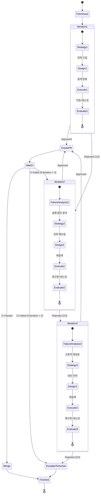

# Issue Forge - Product Requirements Document

## 개요

Issue Forge는 GitHub 이슈를 자동으로 가져와 복수의 AI 에이전트가 협력하여 개발하고, 완성 후 Pull Request를 생성하는 자동화 시스템이다. 각 에이전트는 설계, 코드 작성, 테스트, 리뷰 등 역할을 분담하며, Claude Code와 Gemini를 콘솔 파라미터로 실행하고 마크다운 파일을 통해 결과를 주고받는다.

## 핵심 개념

### Multi-Agent Collaboration

#### Job Flow Diagram

```jobflow
master: Orchestrator
Object: Orchestrator, GitHubClient, Memory, StrategistAgent, ArchitectAgent, CoderAgent, TesterAgent, ReviewerAgent, GitClient

Orchestrator.Run --> GitHubClient.FetchIssue
GitHubClient.FetchIssue.result --> Memory.Initialize

Orchestrator.StartIteration --> Memory.GetIterationCount
Memory.GetIterationCount.first --> StrategistAgent.Analyze
Memory.GetIterationCount.retry --> StrategistAgent.ReStrategize

StrategistAgent.Analyze.result --> Memory.SaveStrategy
StrategistAgent.ReStrategize.result --> Memory.SaveStrategy

Memory.SaveStrategy --> ArchitectAgent.Design
ArchitectAgent.Design.result --> Memory.SaveDesign

Memory.SaveDesign --> CoderAgent.Implement
CoderAgent.Implement.result --> Memory.SaveImplementation

Memory.SaveImplementation --> TesterAgent.Test
TesterAgent.Test.result --> Memory.SaveTestResult

Memory.SaveTestResult --> ReviewerAgent.Evaluate
ReviewerAgent.Evaluate.Approved --> Orchestrator.CreatePR
ReviewerAgent.Evaluate.Rejected --> Memory.SaveFailure

Memory.SaveFailure --> Orchestrator.CheckIterationLimit
Orchestrator.CheckIterationLimit.continue --> Orchestrator.StartIteration
Orchestrator.CheckIterationLimit.exceeded --> Orchestrator.EscalateToHuman

Orchestrator.CreatePR --> GitClient.CreateBranch
GitClient.CreateBranch --> GitClient.Commit
GitClient.Commit --> GitClient.PushAndCreatePR
GitClient.PushAndCreatePR --> Orchestrator.WaitCI

Orchestrator.WaitCI.passed --> Orchestrator.Complete
Orchestrator.WaitCI.failed --> Memory.SaveCIFailure
Memory.SaveCIFailure --> Orchestrator.CheckIterationLimit
```

* Job Flow Diagram Viewer: https://tools.camp/38060808, https://tools.camp/jobflow/

#### State Diagram



### Relay Race Model

continuous-claude의 릴레이 레이스 모델을 채택한다. 각 에이전트는 작업 완료 후 다음 에이전트에게 바톤을 넘기듯 컨텍스트를 전달한다. 공유 마크다운 파일이 외부 메모리 역할을 하여 에이전트 간 컨텍스트 드리프트를 방지한다.

### Strategy-Execute-Evaluate Loop (최대 3회 반복)

실패는 단순 재시도가 아닌 **전략적 학습과 방향 전환의 기회**다. 시스템은 최대 3회까지 전체 사이클을 반복하며, 각 실패에서 배운 내용을 다음 전략에 반영한다.

#### Iteration 1: 초기 시도

```
1. Strategy: 이슈 분석 → 접근 방식 결정 → 리스크 평가
2. Design: 전략을 구체적 설계로 변환 → 파일 구조, API 설계
3. Execute: 코드 구현 → 테스트 작성 및 실행
4. Evaluate: 코드 리뷰 → 품질/보안 검증 → 승인/거절
```

#### Iteration 2: 전략 수정 (1차 실패 시)

```
1. Failure Analysis: 거절 사유 분석 → 근본 원인 파악
2. Strategy: 실패 원인 기반 새로운 접근법 탐색
   - 예: "직접 JWT 구현" → "검증된 라이브러리 사용"
3. Design: 수정된 전략에 맞는 재설계
4. Execute: 재구현 + 테스트
5. Evaluate: 재평가
```

#### Iteration 3: 대안 탐색 (2차 실패 시)

```
1. Failure Analysis: 두 번의 실패 패턴 분석 → 근본적 문제 인식
2. Strategy: 완전히 다른 접근법 고려
   - 예: "JWT 인증" → "OAuth 위임 인증으로 전환"
3. Design: 대안적 아키텍처 설계
4. Execute: 새로운 방식으로 구현
5. Evaluate: 최종 평가
```

#### Escalation (3차 실패 시)

```
1. 전체 시도 이력 요약
2. 각 실패 원인 및 시도한 해결책 문서화
3. 사람에게 에스컬레이션 (Slack/Email 알림)
4. 수동 개입 대기
```

## 시스템 구성

```
System
├── CLI
│   └── Node.js 24.12.0+ LTS (javascript)
├── AI Providers
│   ├── Claude Code (Anthropic)
│   └── Gemini CLI (Google)
├── External Services
│   ├── GitHub API
│   └── GitHub CLI (gh)
├── Storage
│   └── Local Filesystem (Markdown)
└── Configuration
    └── YAML (다중 프로젝트 설정)
```

## Node.js 프로젝트 구조

### 디렉토리 레이아웃

```
issue-forge/
├── package.json
├── tsconfig.json
├── src/
│   ├── index.ts                 # CLI 엔트리포인트
│   ├── cli/
│   │   ├── commands/
│   │   │   ├── init.ts
│   │   │   ├── start.ts
│   │   │   ├── stop.ts
│   │   │   ├── status.ts
│   │   │   ├── run.ts
│   │   │   ├── scan.ts
│   │   │   └── project.ts
│   │   └── index.ts
│   ├── core/
│   │   ├── orchestrator.ts      # 메인 오케스트레이터
│   │   ├── project-monitor.ts   # 다중 프로젝트 모니터
│   │   ├── issue-scanner.ts     # 이슈 스캐너
│   │   ├── issue-filter.ts      # 이슈 필터링
│   │   └── state-manager.ts     # 상태 관리
│   ├── agents/
│   │   ├── base-agent.ts        # 베이스 에이전트
│   │   ├── strategist.ts
│   │   ├── architect.ts
│   │   ├── coder.ts
│   │   ├── tester.ts
│   │   └── reviewer.ts
│   ├── providers/
│   │   ├── ai-provider.ts       # AI 프로바이더 인터페이스
│   │   ├── claude-provider.ts   # Claude Code 실행
│   │   └── gemini-provider.ts   # Gemini CLI 실행
│   ├── github/
│   │   ├── client.ts            # GitHub API 클라이언트
│   │   ├── issue.ts             # 이슈 관련
│   │   └── pr.ts                # PR 관련
│   ├── memory/
│   │   ├── memory-file.ts       # 마크다운 메모리 파일
│   │   └── handoff.ts           # 에이전트 간 핸드오프
│   ├── config/
│   │   ├── loader.ts            # 설정 로더
│   │   ├── schema.ts            # 설정 스키마 (zod)
│   │   └── defaults.ts          # 기본값
│   └── utils/
│       ├── logger.ts
│       ├── cost-tracker.ts
│       └── process.ts           # 자식 프로세스 관리
├── templates/
│   ├── prompts/                 # 에이전트 프롬프트 템플릿
│   │   ├── strategist-analyze.md
│   │   ├── strategist-restrategize.md
│   │   ├── architect-design.md
│   │   ├── coder-implement.md
│   │   ├── tester-test.md
│   │   └── reviewer-evaluate.md
│   └── config/
│       └── default-config.yaml
└── tests/
    ├── unit/
    ├── integration/
    └── fixtures/
```

## 실행 모델

### 무한 루프 + 라운드 로빈

앱은 시작 후 **무한히 반복**하며 프로젝트를 순회하고 이슈를 처리한다.

### 실행 흐름

```python
def main():
    config = load_config()
    projects = config.projects

    while True:  # 무한 루프
        has_issues = False

        # 라운드 로빈: 각 프로젝트에서 이슈 하나씩
        for project in projects:
            issue = get_next_issue(project)

            if not issue:
                continue  # 이 프로젝트에 이슈 없음

            has_issues = True

            try:
                process_issue(project, issue)
            except RateLimitError as e:
                wait_for_rate_limit(e.retry_after)
                process_issue(project, issue)  # 재시도

        if not has_issues:
            # 모든 프로젝트에 이슈 없음 → 대기
            sleep(config.polling_interval)
```

### AI 설정

최고의 모델, 최대의 토큰을 기본으로 사용한다.

| Provider | Model | Context | Output |
|----------|-------|---------|--------|
| Claude | opus | 200K | 최대 |
| Gemini | pro | 1M | 최대 |

## 다중 프로젝트 지원

### 설정 (config.yaml)

```yaml
global:
  polling_interval: 600  # 이슈 없을 때 대기 시간 (초)
  ai_provider: claude    # claude 또는 gemini

projects:
  - path: "/Users/ryu/projects/project-a"
  - path: "/Users/ryu/projects/project-b"
```

## 에이전트 역할 정의

### Strategist Agent (전략가)

* 담당: 이슈 분석, 접근 방식 결정, 리스크 평가, 실패 시 전략 재수립
* 입력: GitHub 이슈, 코드베이스 컨텍스트, 이전 실패 이력 (2차 이후)
* 출력: 전략 문서 (접근 방식, 기술 선택, 리스크 분석, 대안)
* 권장 AI: Claude Code (복잡한 추론에 강점)
* 역할 구분:
  - Iteration 1: `Analyze` - 초기 전략 수립
  - Iteration 2+: `ReStrategize` - 실패 원인 기반 전략 재수립

### Architect Agent (설계자)

* 담당: 전략을 구체적 설계로 변환, 파일 구조 정의, API 설계
* 입력: 전략 문서, 코드베이스 컨텍스트
* 출력: 설계 문서, 구현 계획, 파일 목록, 의존성 그래프
* 권장 AI: Claude Code
* 역할 구분:
  - Strategist가 "무엇을, 왜" 결정
  - Architect가 "어떻게, 어떤 구조로" 결정

### Coder Agent (구현자)

* 담당: 코드 구현, 파일 생성 및 수정
* 입력: 설계 문서, 기존 코드
* 출력: 구현된 코드 파일
* 권장 AI: Claude Code 또는 Gemini

### Tester Agent (테스터)

* 담당: 테스트 작성, 테스트 실행, 커버리지 분석
* 입력: 구현된 코드, 설계 문서
* 출력: 테스트 코드, 테스트 결과 리포트
* 권장 AI: Claude Code 또는 Gemini

### Reviewer Agent (평가자)

* 담당: 코드 리뷰, 품질/보안 검증, 승인/거절 판정
* 입력: 모든 변경사항, 테스트 결과, 전략 문서
* 출력: 리뷰 코멘트, 승인/거절 판정, 거절 시 구체적 피드백
* 권장 AI: 다른 에이전트와 다른 AI 권장 (교차 검증)
* 거절 시 필수 출력:
  - 거절 사유 (구체적)
  - 문제 위치 (파일:라인)
  - 개선 방향 제안

## 공유 메모리 구조

### Memory File Format

```markdown
# Issue Forge Memory - Issue #42

## Issue Summary
- **Title**: Add user authentication
- **Labels**: feature, security
- **Created**: 2025-01-15
- **Max Iterations**: 3

---

# Iteration 1

## [2025-01-15T10:30:00Z] Strategist Agent (Claude) - Analyze
**Iteration**: 1/3
**Duration**: 40s
**Tokens**: 8,200

### Issue Analysis
- 사용자 인증 기능 추가 요청
- 기존 코드베이스: Express + TypeScript
- 보안 요구사항: 높음

### Strategy Decision
**접근 방식**: JWT 기반 stateless 인증
**기술 선택**: jsonwebtoken 라이브러리 직접 사용
**리스크**: 직접 구현 시 보안 취약점 가능성

### Alternatives Considered
1. Passport.js 사용 - 오버킬로 판단
2. Auth0 외부 서비스 - 비용 문제
3. 세션 기반 인증 - stateless 선호

---

## [2025-01-15T10:32:00Z] Architect Agent (Claude) - Design
**Duration**: 45s
**Tokens**: 12,340

### Design Document
- JWT 기반 인증
- Redis 세션 스토어 사용
- 기존 User 모델 확장

### Implementation Plan
1. `src/auth/jwt.ts` - JWT 유틸리티
2. `src/middleware/auth.ts` - 인증 미들웨어
3. `src/routes/auth.ts` - 인증 라우트
4. `src/models/user.ts` - User 모델 수정

---

## [2025-01-15T10:35:00Z] Coder Agent (Claude) - Implement
**Duration**: 120s
**Tokens**: 28,450

### Files Created/Modified
- `src/auth/jwt.ts` (45 lines) - NEW
- `src/middleware/auth.ts` (32 lines) - NEW
- `src/routes/auth.ts` (78 lines) - NEW
- `src/models/user.ts` (+15 lines) - MODIFIED

---

## [2025-01-15T10:38:00Z] Tester Agent (Claude) - Test
**Duration**: 90s

### Test Results
- 35 tests, 35 passing, 0 failing
- Coverage: 94%

---

## [2025-01-15T10:40:00Z] Reviewer Agent (Gemini) - Evaluate
**Duration**: 60s

### Decision: **REJECTED**

### Rejection Reasons
1. `jwt.ts:15` - 비밀키가 하드코딩됨 (Critical)
2. `auth.ts:32` - SQL Injection 취약점 (Critical)
3. 환경변수 검증 누락 (High)

### Feedback for Next Iteration
- 모든 시크릿을 환경변수로 이동
- Raw SQL 사용 금지, ORM 필수
- 시작 시 환경변수 검증 로직 추가

---

# Iteration 2

## [2025-01-15T10:42:00Z] Strategist Agent (Claude) - ReStrategize
**Iteration**: 2/3
**Duration**: 35s
**Tokens**: 6,800

### Failure Analysis
**이전 실패 원인**: 보안 기본 원칙 미준수
1. 하드코딩된 시크릿 → 환경변수 미사용
2. Raw SQL → Injection 취약점
3. 시작 시 검증 부재

### Strategy Revision
**변경된 접근 방식**: 기존 구조 유지 + 보안 강화
- 환경변수 중앙 관리 모듈 추가
- 모든 DB 접근을 ORM으로 전환
- 시작 시 필수 환경변수 검증

### Why This Will Work
- 구조 변경 최소화로 리스크 감소
- 보안 이슈만 집중 해결
- 검증된 패턴 적용

---

## [2025-01-15T10:45:00Z] Architect Agent (Claude) - Design
**Duration**: 30s

### Design Changes
- `src/config/env.ts` 추가 - 환경변수 중앙 관리
- TypeORM QueryBuilder로 전환

---

## [2025-01-15T10:48:00Z] Coder Agent (Claude) - Implement
**Duration**: 60s

### Files Modified
- `src/auth/jwt.ts` (3 lines changed)
- `src/routes/auth.ts` (12 lines changed)
- `src/config/env.ts` (new, 25 lines)

---

## [2025-01-15T10:50:00Z] Tester Agent (Claude) - Test
**Duration**: 45s

### Test Results
- 38 tests, 38 passing, 0 failing
- Coverage: 96%

---

## [2025-01-15T10:52:00Z] Reviewer Agent (Gemini) - Evaluate
**Duration**: 45s

### Decision: **REJECTED**

### Rejection Reasons
1. TypeORM 설정 오류 - DB 연결 실패 (Critical)
2. 환경변수 검증이 런타임에만 동작 - 빌드 타임 검증 필요

### Feedback for Next Iteration
- TypeORM 설정 수정 또는 다른 ORM 고려
- zod 등으로 빌드 타임 환경변수 검증

---

# Iteration 3

## [2025-01-15T10:55:00Z] Strategist Agent (Claude) - ReStrategize
**Iteration**: 3/3 (Final)
**Duration**: 50s
**Tokens**: 9,200

### Failure Pattern Analysis
**2회 연속 실패 원인**:
1. 1차: 보안 기본 원칙 미준수
2. 2차: ORM 전환 과정에서 설정 오류

**근본 문제**: 너무 많은 변경을 한 번에 시도

### Alternative Strategy
**완전히 다른 접근**: 검증된 인증 라이브러리 사용
- `express-jwt` + `jwks-rsa` 조합
- 직접 JWT 핸들링 대신 미들웨어 위임
- 환경변수는 `envalid` 라이브러리로 빌드 타임 검증

### Risk Mitigation
- 널리 사용되는 라이브러리로 보안 검증됨
- 설정 복잡도 낮음
- 커뮤니티 지원 풍부

---

## [2025-01-15T10:58:00Z] Architect Agent (Claude) - Design
**Duration**: 35s

### New Architecture
- 기존 jwt.ts 삭제
- express-jwt 미들웨어 사용
- envalid로 환경변수 검증

---

## [2025-01-15T11:02:00Z] Coder Agent (Claude) - Implement
**Duration**: 80s

### Files Changed
- `src/auth/jwt.ts` - DELETED
- `src/middleware/auth.ts` - REWRITTEN (15 lines)
- `src/config/env.ts` - REWRITTEN with envalid
- `package.json` - Added express-jwt, envalid

---

## [2025-01-15T11:05:00Z] Tester Agent (Claude) - Test
**Duration**: 50s

### Test Results
- 32 tests, 32 passing, 0 failing
- Coverage: 92%

---

## [2025-01-15T11:08:00Z] Reviewer Agent (Gemini) - Evaluate
**Duration**: 40s

### Decision: **APPROVED**

### Approval Notes
- 검증된 라이브러리 사용으로 보안 강화
- 코드 간결성 향상
- 빌드 타임 환경변수 검증 정상 동작

---

# Final Summary

| Metric | Value |
|--------|-------|
| Total Iterations | 3 |
| Total Duration | 825s (13분 45초) |
| Total Tokens | 98,650 |
| Estimated Cost | $1.78 |
| Result | **APPROVED** - PR 생성 진행 |

## Strategy Evolution
1. **Iteration 1**: 직접 JWT 구현 → 실패 (보안 취약점)
2. **Iteration 2**: 보안 수정 + ORM 전환 → 실패 (설정 오류)
3. **Iteration 3**: 검증된 라이브러리 전환 → 성공

## Key Learnings
- 보안 관련 구현은 검증된 라이브러리 우선 고려
- 한 번에 많은 변경보다 점진적 접근 권장
- 빌드 타임 검증으로 런타임 오류 예방
```

## 워크플로우

### Phase 1: Issue Fetch & Initialize

```
1. GitHub API로 이슈 정보 가져오기
2. 이슈 본문, 라벨, 코멘트 파싱
3. 연관 파일 추론 (언급된 파일, 라벨 기반)
4. Memory 파일 초기화
5. iteration_count = 0
```

